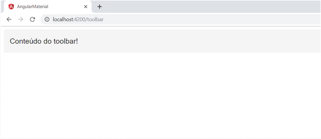
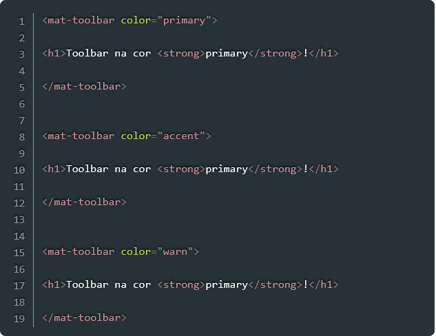
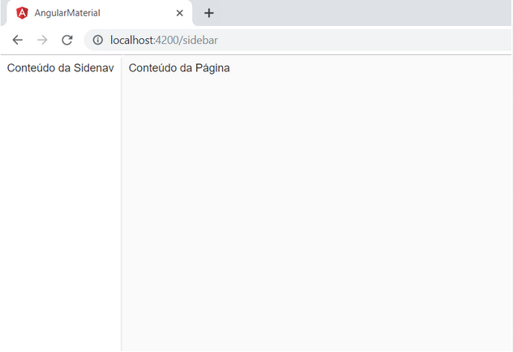
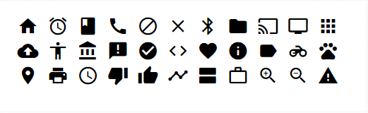
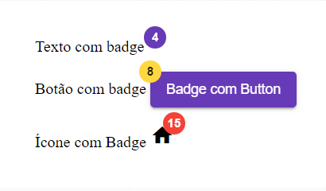
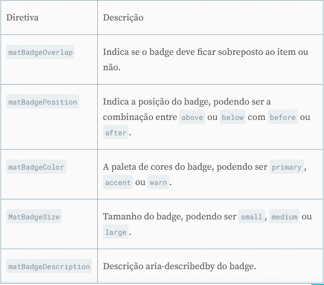
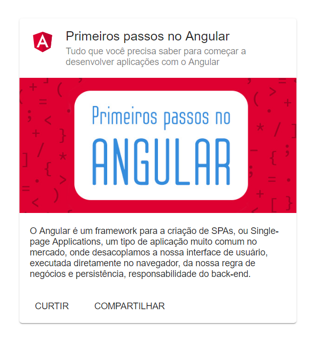
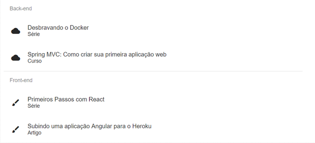
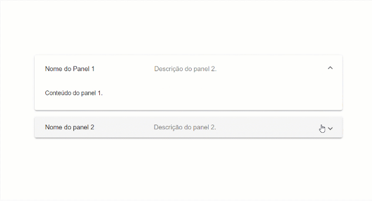
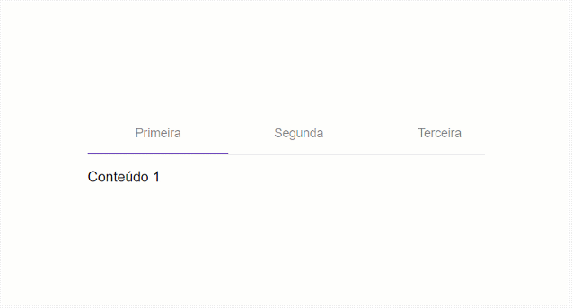

# Primeiros passos com o Angular Material
Quando construímos interfaces com o Angular criamos componentes para cada uma das partes dessa interface, de forma que possamos aproveitá-los em outras partes da aplicação sem repetição de código. Essa prática aumenta a manutenibilidade do código e agiliza o desenvolvimento, uma vez que não precisamos criar essas partes do zero cada vez que eles aparecem.

* __Uma forma de saber se sua interface está bem componentizada é calcular o número de vezes que você precisou copiar e colar código. Se o número de vezes for maior que zero, alguma coisa pode ser melhorada. Isso porque, se uma parte da interface aparece mais de uma vez, esta deveria ser um componente.__

O **Angular Material** é a implementação **oficial**, para o Angular, do Material Design, a especificação de design para interfaces interativas do Google. O Material Design cobre desde pequenos elementos, como ícones e cores, até elementos maiores como navegação, cards, imagens e muito mais.

* __O Angular Material CDK, ou Component Dev Kit, é um conjunto de componentes, dentro do Angular Material, que implementa comportamentos comuns como Drag and Drop, sem opinar quanto a aparência dos elementos visuais que serão utilizados em conjunto com esses comportamentos. Podemos, então, criar Drag and Drop com imagens, texto ou qualquer outro componente.__

> Para instalar esses pacotes, basta executar o seguinte comando no diretório da aplicação:
```npm install --save @angular/material @angular/cdk @angular/animations```

# Componentes de navegação
O Angular Material fornece três componentes muito utilizados em qualquer aplicação: toolbar, menu e sidenav. O primeiro, toolbar, se trata de um contêiner para títulos, cabeçalhos e botões. O segundo, menu, permite a criação de menus e submenus dropdown. O último, sidenav, se trata de um menu lateral muito utilizado em interfaces responsivas e aplicativos mobile.

## Toolbar
O componente toolbar permite agruparmos links, menus e títulos em uma barra de ferramentas, normalmente localizada no topo da aplicação:
1. Exemplo.

> O componente permite alterar a paleta de cores do toolbar para primary, accent ou warn. A cor do fundo e do texto será escolhida de acordo com o tema que você escolheu para sua aplicação:
2. Exemplo 2 - trocando a cor de fundo do **ToolBar**.


# Menu
Com o componente Menu podemos criar menus do tipo dropdown com links e submenus. Em sua forma mais básica, um menu dropdown é composto de um botão que, ao ser clicado, abre uma aba com outros dois botões:

# Sidenav
Um dos elementos mais utilizados em aplicações que seguem o Material Design é a sidenav. Uma sidenav é uma barra lateral que pode agrupar menus, links ou qualquer outra informação útil para o usuário:

1. Exemplo.

Em sua forma mais simples, a sidenav é composta da barra lateral fixa e uma área, também fixa, para o conteúdo da página, conforme visto na imagem

# Ícones, Botões e Indicadores
O Angular Material fornece componentes para botões dos mais diversos tipos, ícones, alertas e barras de carregamento.

## Icons
O Angular Material fornece uma gama de ícones que podemos utilizar na nossa aplicação como simples componentes:

1. Exemplo.


## Button
O elemento button, do HTML, pode ser estilizado com o Angular Material de forma a seguir os padrões do Material Design. Em sua forma mais básica temos um botão de fundo transparente e texto de cor que pode variar de acordo com o tema escolhido para a aplicação:

* Entretanto, diferentemente dos elementos que vimos até então, nós não utilizaremos componentes para estilizar os botões, mas sim diretivas. Diretivas são um recurso do Angular que permite modificarmos a aparência e atribuir comportamento a elementos HTML.

## Badges
No Material Design, badges são pequenos selos onde podemos colocar informações adicionais referente ao texto, botão ou ícone:

1. Exemplo.


Badges, assim como buttons, não são componentes, mas sim diretivas. Para utilizá-los basta incluir a diretiva matBadge a um elemento HTML ou componente. Outras diretivas também estão disponíveis, tais como:

2. Exemplo.


## Progress Spinner
Em algumas situações, as ações do usuário podem ocasionar um processamento longo ou mesmo uma requisição para o servidor. Nesses casos, para que indiquemos para o usuário que a aplicação está realizando a tarefa, podemos mostrar um progress spinner até que a tarefa seja finalizada:

## Progress Bar
Similar ao progress spinner, também podemos utilizar a progress bar para indicar pro usuário que uma tarefa está sendo executada:

# Layout
Componentes do tipo Layout são componentes utilizados, normalmente, para organizar o conteúdo da interface, de forma a facilitar a localização do conteúdo, títulos e menus. Dentre diversos componentes, os mais utilizados são **Cards**, **Divider**, **Expansion Panel**, **List**, **Stepper** e **Tabs**.

## Cards
Os cards do Material Design são amplamente utilizados para separar conteúdos distintos que apareçam em uma mesma tela:

1. Exemplo.


## List
Listas são amplamente utilizadas em qualquer aplicação, e com o Material Design elas ganham uma aparência especial:

1. Exemplo.


## Expansion Panel
Expansion Panel permite escondermos informações até que o usuário clique para vê-las. Dessa forma, conseguimos construir interfaces mais limpas sem abrir mão de fornecer informações importantes ao usuário:

1. Exemplo.


## Tabs
Tabs são amplamente para organizar o conteúdo em diferentes abas. Uma aba é escolhida para ser exibida para o usuário (normalmente a primeira) e as seguintes, para que o usuário possa visualizá-las, precisará clicar em seu respectivo link do menu:

1. Exemplo.
